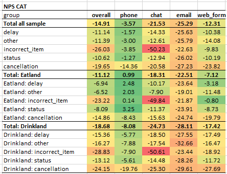
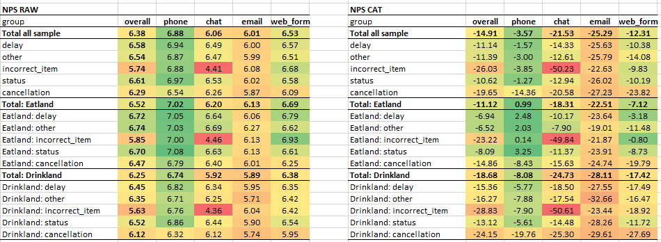
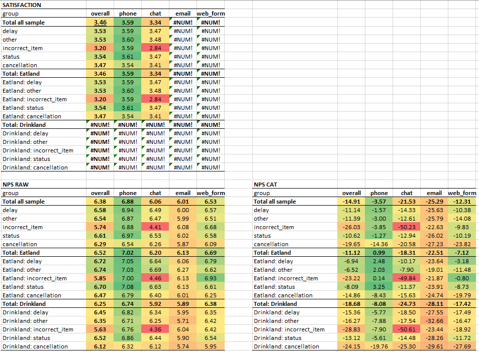

# 0. Setup

```{r}
library(psych)
library(ggplot2)
library(readxl)#to see the database
library(openxlsx)#to save the database in excel
library(dplyr) # for data manipulation
library(tidyr) # for transforming datasets to long and wide formats
library(ordinal) # for ordinal logistic regression
library(car) # for VIF calculations
library(vcd) # for visualizing relations between factors
library(VGAM)
library(coefplot) # for plots about coefficients
```


# 1. Data Simulation

## 1.1. Simulation of demographic and contextual variables
Variables <- c("gender", "age", "method", "country", "reason", "nps_score", "satisfaction", "complain.connect", "complain.respond.vel", "complain.solve.vel", "complain.repeat" )

```{r}

set.seed(1000)

data.n <- 5*4*2*1000

data <- data.frame (id = as.factor(c(1:data.n)))


data$age <- round(rlnorm(n=data.n, meanlog= log(40), sdlog=log(1.4)))
data$age [data$age>90] <- 90
data$age [data$age<15] <- 15

data$gender <- factor(sample(c("man", "woman"), prob= c(0.5, 0.5), replace= TRUE, size = data.n))
data$country <- factor(sample(c("Drinkland","Eatland"), prob= c(0.5, 0.5), replace= TRUE, size = data.n))
data$method <- factor(sample(c("chat", "web_form", "email", "phone"), prob= c(0.4, 0.10,0.15, 0.35), replace= TRUE, size = data.n))
data$reason <- factor(sample(c("incorrect_item", "delay", "status","cancellation", "other"), prob= c(0.2, 0.3,0.2,0.1, 0.2), replace= TRUE, size = data.n))
data$open.comment <- rep("bla bla", data.n)


```

## Simulation of frequency of complaints depending of the demographic and contextual factors

We will simulate the presence of complaints about the connection (complain.connect), the speed to respond (complain.sp.respond), the speed to solve the problem (complain.sp.solve) and complains about repeating information (complain.repeat), attending to several factors: 

- complaints about connection will be higher in the country Drinkland
- complaints about speed to response will strongly higher in email, and moderately higher in chat and web forms. 
- complaints about speed to solve will be higher in incorrect item deliveries attended through chat.
- complaints about the need to repeat information will be higher in order cancellation. 
- other complaints have similar distribution across countries, contact reasons and contact methods

For each type of complaint we will set an initial probability, then we will alter that probability depending on the presence of the mentioned factors. 

```{r}

##For connection complaints
# we set an initial probability of 0.1 of the complaints to appear
con.prob <- rep(0.1,data.n) 
# we set a double probability of connection complains in Drinkland
con.prob [data$country=="Drinkland"] <- con.prob [data$country=="Drinkland"] *2 
#We ensure the probabilities are contained between 0 and 1 (for prevention in further transformations)
con.prob[con.prob>1] <- 1
con.prob[con.prob<0] <- 0
#we create the variable attending the above probabilities for each of our cases
data$complain.connect<- rbinom(n=data.n, size =1, prob=con.prob)
#to check the results are as expected: 
with(data,prop.table(table(complain.connect,country), margin=2))


##For complaints about the speed to respond
# we set an initial probability of 0.05 of the complaints to appear
spr.prob <- rep(0.05,data.n) 
# we set a 6 times higher probability for complains to appear for email
spr.prob [data$method=="email"] <- spr.prob [data$method=="email"] *6 
#We set a 3 times higher probability for complaints to appear for chat and web forms
spr.prob [data$method %in% c("chat", "web_form")] <- spr.prob [data$method %in% c("chat", "web_form")] *3
#We ensure the probabilities are contained between 0 and 1 (for prevention in further transformations)
spr.prob[spr.prob>1] <- 1
spr.prob[spr.prob<0] <- 0
#we create the variable attending the above probabilities for each of our cases
data$complain.sp.respond<- rbinom(n=data.n, size =1, prob=spr.prob)
#to check the results are as expected: 
with(data,prop.table(table(complain.sp.respond,method),margin=2))


##For complaints about the speed to solve
# we set an initial probability of 0.1 of the complaints to appear
sps.prob <- rep(0.1,data.n) 
# we set a 5 times higher probability for contact reasons of incorrect items that are attended by chat
sps.prob [data$method=="chat" & data$reason=="incorrect_item"] <- sps.prob [data$method=="chat" & data$reason=="incorrect_item"] *5
#We ensure the probabilities are contained between 0 and 1 (for prevention in further transformations)
sps.prob[sps.prob>1] <- 1
sps.prob[sps.prob<0] <- 0
#we create the variable attending the above probabilities for each of our cases
data$complain.sp.solve<- rbinom(n=data.n, size =1, prob=sps.prob)
#to check the results are as expected: 
with(data,prop.table(table(complain.sp.solve,reason,method),margin=c(2:3)))

##For complaints about the need to repeat information
# we set an initial probability of 0.02 of the complaints to appear
rp.prob <- rep(0.02,data.n) 
# we set a 10 times higher probability for contact reasons about cancellations
rp.prob [data$reason=="cancellation"] <- rp.prob [data$reason=="cancellation"] *10
#We ensure the probabilities are contained between 0 and 1 (for prevention in further transformations)
rp.prob[rp.prob>1] <- 1
rp.prob[rp.prob<0] <- 0
#we create the variable attending the above probabilities for each of our cases
data$complain.repeat<- rbinom(n=data.n, size =1, prob=rp.prob)
#to check the results are as expected: 
with(data,prop.table(table(complain.repeat,reason),margin=2))

##For other complaints

data$complain.other<- rbinom(n=data.n, size =1, prob=.2)
#to check the results are as expected: 
with(data,prop.table(table(complain.other)))

```


##Simulation of NPS scores 

We first assume a normal distribution of responses in the ideal case in which customers have no complaints.  
Then we apply the corrections based on the information we have simulated about the presence of different complaints. 

At the end, we limit the scores to 0 and 10 and transform them to integers, in line with restrictions of NPS scores. 

```{r}

#Preliminary distribution in case of no complaints. We use a high mean value
data$nps.score <- rnorm(data.n, mean=9, sd= 2)


#We adjust the scores for the presence of complaints. We are applying fixed penalties to NPS scores based on the presence of complaints (e.g., 3 points if there are connection complaints).While using a binomial distribution could add randomness (and realism), we opt for fixed values to make the relationships easier to interpret. 
data$nps.score <- data$nps.score -
3 * data$complain.connect -
4 * data$complain.sp.respond -
6 * data$complain.sp.solve -
2 * data$complain.repeat -
1 * data$complain.other 

# to limit the values between 0 and 10:
data$nps.score[data$nps.score<0] <- 0
data$nps.score[data$nps.score>10] <- 10 

# to convert to integer values
data$nps.score <- floor (data$nps.score)


#to see the distribution of scores

barplot(table(data$nps.score)) 

with(data,(prop.table(table(data$nps.score))))


```


### Specifying the NPS segments based on NPS scores

```{r}
data$nps.segment <- rep(NA_character_, data.n)

data$nps.segment [data$nps.score<=6] <- "detractor"
data$nps.segment [data$nps.score >6 & data$nps.score <9] <- "passive"
data$nps.segment [data$nps.score>=9] <- "promoter"

data$nps.segment <- factor (data$nps.segment)

#to check the results
with(data, prop.table(table(nps.segment)))
```

##Simulation of satisfaction scores


```{r}

data$satisfaction <- floor(rnorm(data.n, mean = 3, sd=0.5) + 0.9 * (1 + as.numeric(scale(data$nps.score))))

data$satisfaction[data$satisfaction<1] <- 1
data$satisfaction[data$satisfaction>5] <- 5

# To see the distribution
barplot(table(data$satisfaction))
with(data,prop.table(table(satisfaction)))


# To check the correlation with NPS
with(data, cor(nps.score,satisfaction, method="spearman"))


```

##Simulation of missing data

###Missing data for satisfaction

We simulate that satisfaction was not available for the country Drinkland, and for the contact methods of email and webform. 
Additionally, within those situations in which the satisfaction item was available, there is 10% probability that customers do not answer to it.

```{r}

data$satisfaction[data$country=="Drinkland"]<- NA_real_
data$satisfaction[data$method %in% c("email","web_form")]<- NA_real_


na_randomizer <- sample(c(0,1), size=sum(!is.na(data$satisfaction)), replace=TRUE, prob= c(0.1,0.9))
data$satisfaction[which(!is.na(data$satisfaction))[ na_randomizer==0]]<- NA_real_

#We see the results
summary(data$satisfaction)

```


# 2. Exploration of Satisfaction and Probability to Recommend  across Methods, Reasons, and Countries

## 2.1. Measurement considerations
Our main goal was to understand customer satisfaction. But, we didn't have satisfaction data readily available for all countries and contact methods. Given this limitation, and because our key stakeholders were already familiar with it, we decided to use the Net Promoter Score (NPS) as our primary indicator.

NPS measures customer loyalty and how likely they are to recommend our services. It gave us a consistent way to evaluate customer perception across all the different areas we were interested in. For this analysis, NPS acted as a good proxy for overall customer experience and satisfaction.

To make sure NPS was a reliable stand-in for satisfaction, I took a few key steps:

- I checked for a strong correlation between satisfaction scores and NPS scores. I looked at whether the satisfaction score was correlated with both, the raw scores (the 0-10 scale used for NPS) and the categorical scores (the percentage of Promoters minus Detractors for NPS).

- For cases where we did have satisfaction data, I ran parallel analyses using those scores. This helped me see if the trends and insights matched what we found with NPS, or if any new patterns emerged.

## 2.1.1. Correlations between satisfaction scores and NPS scores

We first explored the distribution shapes for both satisfaction and nps scores, using bar charts from the ggplot2 package: 

```{r}
# Distribution of the NPS scores: 

ggplot(data[!is.na(data$nps.score), ], aes(x = factor(nps.score))) +
  geom_bar(fill = "#2980b9") +
  labs(
    title = "Distribution of NPS Scores",
    x = "NPS Score",
    y = "Count"
  ) +
  theme_minimal()

# Distribution of satisfaction scores: 

ggplot(data[!is.na(data$satisfaction), ], aes(x = factor(satisfaction))) +
  geom_bar(fill = "#27ae60") +
  labs(
    title = "Distribution of Satisfaction",
    x = "Satisfaction Score",
    y = "Count"
  ) +
  theme_minimal()
```
Neither of the distributions follows a normal distribution, with both nps.score and satisfaction showing left-skewed patterns. Notably, the distribution of nps.score also shows signs of a ceiling effect, with a considerable proportion of scores concentrated at the upper end of the scale.

Given these distributional characteristics, Pearson's correlation is not an appropriate choice, as it assumes linearity and approximate normality, and can be highly sensitive to skewed or bounded data.

Before selecting a more robust correlation measure—such as Spearman's rank or polychoric correlation—we will inspect the relationship between nps.score and satisfaction using a scatterplot. This will allow us to visually assess the form and strength of the association and decide whether the relationship appears monotonic or not.

```{r}
# create the scatterplot (using the package ggplot 2)
ggplot(na.omit(data[, c("nps.score", "satisfaction")]), aes(x = jitter(nps.score), y = jitter(satisfaction))) +
  geom_point(alpha = 0.5, color = "#2c3e50") +
  labs(
    title = "Relation between NPS Scores and Satisfaction",
    x = "NPS Score",
    y = "Satisfaction"
  ) +
  theme_minimal()


```

The scatterplot reveals a strong monotonic and linear relationship between NPS score and Satisfaction. Considering that both variables are ordinal, we will use Spearman’s rank correlation, which assesses the strength of monotonic associations without requiring interval-level measurement or normal distribution.


```{r}
# The Spearman correlation (using the psych package): 
with(data, corr.test(nps.score, satisfaction, method="spearman", use= "complete.obs"))


```

Our analysis revealed a strong positive Spearman correlation between satisfaction and NPS scores, which provides confidence that NPS effectively serves as a proxy for customer satisfaction in this dataset. 


##2.2. Heatmaps of Scores Across Methods, Reasons, and Countries

Since we had many levels across contact methods, contact reasons and countries, we wanted to create a heatmap that would allow us and our stakeholders to explore the effects of these factors and their interactions. 

###2.2.1. Reusable function to get heatmaps across factors

We first specified a function to obtain these heatmaps for all of our dependent variables, and for any function we wanted to apply (e.g., mean, NPS categorical...). 


```{r}

f.heatmap.3f <- function(my.data, my.dv, factor.columns, factor.rows, factor.blocks, my.function){


# Create the list object to keep the results, and an object to index them (starting with 1)
results <- list()
k <- 1


#I obtain the unique levels of the factors
factor.column.levels <- unique(my.data[[factor.columns]])
factor.rows.levels <- unique(my.data[[factor.rows]])
factor.blocks.levels <- unique(my.data[[factor.blocks]])


# 1. Results for a general block that does not desagregate results by the block factor
    
#1.1. First line with totals
#it will contain the value for the whole sample, and this total desagregated by the column factor

##1.1.1 Create the label for specifying we refer to results of the whole sample
row.label.t <- paste0("Total all sample")

##1.1.2. Calculate the total results for the whole sample
vector.total <- my.data[[my.dv]] # vector with all the scores
vector.total.clean <- vector.total [!is.na(vector.total)] # vector without NAs
if (length(vector.total.clean) >0){
  total <- my.function(vector.total.clean)
} else {stop("The dataset is empty")
}

##1.1.3. Calculate the total results for the columns factor
c.total <- sapply(factor.column.levels, function(c){
  vector.c.total <- my.data[ my.data[[factor.columns]] == c, my.dv ]
  vector.c.total.clean <- vector.c.total [!is.na(vector.c.total)]
  if (length(vector.c.total.clean) > 0){
    my.function(vector.c.total.clean)
  }else{
    NA_real_
  }
})

## 1.1.4. Save the results of this line in a named vector
results[[k]] <- c(group = row.label.t, overall = total, setNames(object= c.total, factor.column.levels) ) 
k <- k+1

# 1.2. Create additional lines for the general block
      #each line will shows results of the whole sample for each level of the row factor
      #and additional columns for that result desagregated by the colums factor 

##1.2.1. Create a loop for each level in the row factor
for (r in factor.rows.levels){
  
  ##1.2.2. Create a label for each line
  row.label.r <- paste0(r)
  
  ##1.2.3. Calculate the total for each level of the row factor
  r.total.vector <- my.data[my.data[[factor.rows]]==r, my.dv ]
  r.total.vector.clean <- r.total.vector [!is.na(r.total.vector)]
  if(length(r.total.vector.clean)>0){
    r.total <- my.function(r.total.vector.clean)
  } else{
    r.total <- NA_real_
  }
  
  ##1.2.4. Calculate the value for each level in the row factor
  rc.crossed <- sapply(factor.column.levels, function(c){
    rc.crossed.vector <- my.data[my.data[[factor.rows]] == r &
                                  my.data[[factor.columns]] == c,
                                  my.dv]
    rc.crossed.vector.clean <- rc.crossed.vector [!is.na(rc.crossed.vector)]
    
    if(length(rc.crossed.vector.clean)>0){
    my.function(rc.crossed.vector.clean)
    }else{
    NA_real_
    }
  })

  ##1.2.5. We save the results
  results[[k]] <- c(group = row.label.r, overall = r.total, setNames(object=rc.crossed, factor.column.levels))
  k<- k+1
  
} # Close the loop for the levels of the row factor


# 2.Results for each level of the block factor

#2.1. first line with totals
# it will contain the results for the total of the block and that result desagregated by the column factor

# 2.1.1. We create a loop for each block
for (b in factor.blocks.levels){
  
  ## 2.1.2.Label the line to put the result for the block 
  row.label.b <- paste0("Total: ", b)
  
  ## 2.1.3.Calculate the total for the block
  b.vector <- my.data[ my.data[[factor.blocks]]== b, my.dv]
  b.vector.clean <- b.vector[!is.na(b.vector)]
  if(length(b.vector.clean)>0){
    b.total <- my.function(b.vector.clean)
  }else{
    b.total <-NA_real_
  }
  

  ## 2.1.4.Calculate the results for the block desagregated by the columns factor
  bc.crossed <- sapply(factor.column.levels, function(c){
    bc.crossed.vector <- my.data [ my.data[[factor.blocks]] == b &
                                  my.data[[factor.columns]] == c, 
                                  my.dv]
    bc.crossed.vector.clean <- bc.crossed.vector[!is.na(bc.crossed.vector)]
    if(length(bc.crossed.vector.clean)>0) {my.function(bc.crossed.vector.clean)
      }else{NA_real_}
  }) 
  
  ## 2.1.5. Save the results for the block in a named vector
  results [[k]] <- c(group = row.label.b, overall= b.total, setNames(object=bc.crossed, factor.column.levels))
  k<- k+1 
 
  
      # 2.2. Add the remaining lines corresponding to each block.
      #each line will shows the total results for each level of the row factor within that block, 
      #and that result desagregated by the column factor.     
  
      ## 2.2.1. Create a sub-loop for rows, within the prior loop of blocks 
      for(r in factor.rows.levels){ 
    
        ## 2.2.Label each line specifying the block and row crossed 
        row.label.br <- paste0(b, ": ", r)  
        
        ## 2.3.Obtain the result for the block and row factors crossed 
        br.crossed.vector <- my.data[my.data[[factor.blocks]] == b &
                                      my.data[[factor.rows]] == r,
                                      my.dv]
        br.crossed.vector.clean <- br.crossed.vector[!is.na(br.crossed.vector)]
        if(length(br.crossed.vector.clean)>0){
          br.crossed <- my.function (br.crossed.vector.clean)
        }else{
          br.crossed <- NA_real_
        }
        

        ## 2.4. Obtain the result for the cross of the three factors
        all.crossed <- sapply(factor.column.levels, function(c){
        all.crossed.vector <- my.data[my.data[[factor.blocks]] == b & 
                                    my.data[[factor.rows]]==r &
                                    my.data[[factor.columns]] == c,
                                    my.dv]
        all.crossed.vector.clean <- all.crossed.vector[!is.na(all.crossed.vector)]
          if (length(all.crossed.vector.clean) > 0){my.function(all.crossed.vector.clean)}
            else {NA_real_} #
        })
    
        ## 2.5. Save the results of each line in a named vector
        results [[k]] <- c(group= row.label.br, overall = br.crossed, setNames(object=all.crossed, factor.column.levels))
        k <- k+1
        
      } ###close the loop for the rows factor
 
} ### close the loop for the blocks factor


  
# 3. We agregate the results in a dataframe and return the dataframe

results.df <- as.data.frame(do.call(rbind, results), stringsAsFactors = FALSE)

results.df[,-1] <- lapply(results.df[,-1],as.numeric)

return(results.df)
}


```


### 2.2.2. Heatmap for NPS in categorical scores

To obtain the NPS in categorical terms, we also created a simple reusable function to obtain these scores from any vector of nps raw scores.  

```{r}

f.nps.cat <- function (my.nps.vector, na.rm=TRUE){ # my.nps.vector is a numeric vector of raw NPS scores. It can contain NAs
  
  vector.c <- my.nps.vector[!is.na(my.nps.vector)] # vector clean of NAs
  
  # error messages if sample size = 0 or if there are scores out of the typical range of nps raw scores:
  if(length(vector.c) == 0) {stop("error: no available nps raw scores")} 
  if(length(vector.c[vector.c > 10]) > 0) {stop("error: scores higher than 10 in the nps raw scores")} 
  if(length(vector.c[vector.c < 0]) > 0) {stop("error: scores lower than 0 in the nps raw scores")} 
  
  #warning if sample size is below 70
  if(length(vector.c) < 70) {warning("few scores available for calculation (n<70)")} 
  
  n <- length(vector.c) # sample size (without missing data)
  prop.promoters <- (length(vector.c[vector.c>=9]))/n # proportion of promoters
  prop.detractors <- (length(vector.c[vector.c<=6]))/n #proportion of detractors
  nps.cat <- (prop.promoters - prop.detractors)*100 # nps score in categorical terms
  
  return (nps.cat) #returns nps in categorical terms
}

#Check if it is working as expected

f.nps.cat(data$nps.score)
with(data, prop.table(table(nps.segment)))

```

The function is working correctly, we can see that the score we obtain is equal to substracting the percentage of promoters and detractors that we calculated with the table function on the nps.segment variable. 

Yet, before getting results, we check if our sample sizes are acceptable and not prone to sampling biases

```{r}

nps.cat.heatmap.n <- f.heatmap.3f (
  my.data = data,
  my.dv = "nps.score",
  factor.columns = "method",
  factor.rows = "reason",
  factor.blocks = "country",
  my.function = length
)
```

All sample sizes are high across all cells (n > 150), suggesting little probability of sampling error. 

Now we are ready to calculate the heatmap for the NPS categorical using the functions we have prepared.


```{r}

nps.cat.heatmap <- f.heatmap.3f (
  my.data = data,
  my.dv = "nps.score",
  factor.columns = "method",
  factor.rows = "reason",
  factor.blocks = "country",
  my.function = f.nps.cat #Calculation of nps categorical values
)

# We export it to excel to add colors with conditional formatting
write.xlsx (nps.cat.heatmap, "nps.cat.heatmap.xlsx", colnames = TRUE) 

```


After applying conditional formatting in excel based on colors, we get our heatmap to identify areas in which probability to recommend our customer service is very low: 


```{r}

```

The observation of the heatmap suggest us several effects: 
  - Customers in Drinkland have lower probability to promote than Eatland. 
  - Customers contacting for cancellations have lower probability to promote than customers calling for other reasons. 
  - Phone is the contact method associated with highest probability to promote, while emai is associated with the lowest. 
  - Customers contacting through chat for incorrect item deliveries feel very low probability to promote. 
  
Yet, before we proceed to further investigate these effects, we check if we find similar patterns with other measures. The NPS categorical, although have the advantage of being familiar to our stakeholders, has several limitations, such as potentially leading to confusions because of the information lost by the % substraction (it is based on substracting the % of promoters, those who score between 9 and 10, to the % of detractors, those who score between 1 and 6). To illustrate this limitation, a categorical NPS score of 20 can come from infinite distributions of NPS raw scores, including some as different as : 
- distribution a) 60% of promoters and 20% of detractors
- distribution b) 20% of promoters and 0% of detractors. 


### 2.2.3. Heatmap for NPS in raw scores

To make sure the NPS categorical is not leading us to confusing patterns and ambigüities, we check if we obtain similar patterns with the NPS raw score. We apply our premaid heatmap formula to the mean of the NPS raw scores


```{r}

nps.raw.heatmap <- f.heatmap.3f (
  my.data = data,
  my.dv = "nps.score",
  factor.columns = "method",
  factor.rows = "reason",
  factor.blocks = "country",
  my.function = mean # calculation of the mean of the nps raw scores
)
# Export it to excel to add colors with conditional formatting
write.xlsx (nps.raw.heatmap, "nps.raw.heatmap.xlsx", colnames = TRUE)

# We visualize both heatmaps after adding the colors in excel: 



```

We can see a similar pattern for both ways to calculate the results of the NPS, as we described in the section x. 

Yet, we still have doubts about the quality of the NPS as a measure, in which customers ask for the probability to promote. To further gain confidence on it, we check its correspondence with the satisfaction scores. 


### 2.2.2. Heatmap for satisfaction scores

For satisfaction we only had scores for one country (Eatland) and for 2 contact methods (phone and chat). However, these scores are expected to be a more valid measures of satisfaction than the NPS scores, so we will use them to see if they show a different pattern than the NPS scores.  


For that, we apply the function we created in the prior section to the satisfaction scores, and we save the obtained dataframe into excel to further clean and include colors in the heatmap. 


```{r}

satisfaction.heatmap <- f.heatmap.3f (
  my.data = data,
  my.dv = "satisfaction", 
  factor.columns = "method",
  factor.rows = "reason",
  factor.blocks = "country",
  my.function = mean # calculation of the mean for the satisfaction scores
)

# Export it to excel to add colors with conditional formatting
write.xlsx (satisfaction.heatmap, "satisfaction.heatmap.xlsx", colnames = TRUE)

# We visualize all heatmaps after adding the colors in excel: 



```

We can see a similar pattern for satisfaction and both ways to calculate the results of the NPS, suggesting that our NPS categorical measure in this context, is a good indicator of satisfaction, and that we can simplify our conversations with stakeholders by focusing on this measure. 

Yet, to make sure our sight is not tricking us, we also check how the results are correlated


###2.2.4. Correlation coefficients between NPS measures and satisfaction

To see the strength of the correlations we will calculate Pearson correlations across the three measures for each cell in the heatmap. For that, we first move all the cells of the heatmaps databases in a single column, then apply the correlation. 


```{r}
#Move all cells in the heatmaps to a single column                                                
sat.long <- satisfaction.heatmap %>% pivot_longer(cols = c(-1),
                                 names_to = "evaluation",
                                 values_to = "satisfaction") # results of satisfaction heatmap in a single column

nps.raw.long <- nps.raw.heatmap %>% pivot_longer(cols = c(-1),
                                 names_to = "evaluation",
                                 values_to = "nps.raw")  # results of nps raw heatmap in a single column

nps.cat.long <- nps.cat.heatmap %>% pivot_longer(cols = c(-1),
                                 names_to = "evaluation",
                                 values_to = "nps.cat")  # results of nps cat heatmap in a single column

#Merge the columns for all measurs in a single dataset
merged.heatmaps <-merge(nps.cat.long, (merge(sat.long, nps.raw.long, by= c("group", "evaluation"))), by =c ("group", "evaluation"))

#Apply Pearson correlations
cor(merged.heatmaps[,3:5], use="complete.obs") #Correlation matrix across the results for the three measures

```

All measures appear to be strongly correlated (r > .90), giving us confidence on the NPS categorical being a good indicator of satisfaction and probability to promote. This is a good new because our stakeholders are more familiar with this measure, and we can use its heatmap to discuss effects with them. 


## 2.3. Statistical Models about Factors Related to Probability to Promote. 

While the visualization of the heatmaps was already informing us about important aspects in which customer service is performing lower, we further explore these relations with statistical models.

### 2.3.1. Building an Ordinal logistic model. 

We consider that an ordinal logistic model is more appropriate than a lineal model because our variable to predict, nps scores, is an ordinal variable in which it is difficult to assume similar distances across all of the scores, specially due to the ceiling and floor effects that we infer from its distribution (see section x). 

Furthermore, a linear model would not fulfill the assumption for the normality of residuals, as we can see in the QQ plots below, even when we use a square transformation of the variable.  

```{r}
#Checking normality and homocedasticy of residuals of the linear model
linear.model <- lm (nps.score ~ method + reason + country, data =data)
par(mfrow =c(2,2))
plot(linear.model)

#Checking normality and homocedasticy of residuals of the linear model with the squared transformation
linear.model.sq <- lm ((nps.score^2) ~ method + reason + country, data =data)
par(mfrow =c(2,2))
plot(linear.model.sq)

```


As we can see in the Q-Q plots, the residuals' distributions differ strongly from the hypothetical normal distribution. 

At this point, we also considered that an ordinal model was preferable than a binomial logistic regression, because it would provide information about the effects of the factors across the whole NPS scale, rather than just on a single NPS category.  

It is important to note that we also had the option to use a 
For all of these reasons, we proceed with ordinal logistic regression. 


###2.3.1.1. Setting References across the Categories of the Factors

Just to make the interpretation more intuitive, we set the levels of our factors in a way that the levels with higher nps scores are specified first (following the heatmap we calculated earlier). That way, the best levels will be used as reference to compare the effect of the others. 


```{r}
data$method <- factor(data$method, levels = c("phone", "web_form", "chat", "email"))
data$reason <- factor(data$reason, levels = c("other","status", "delay", "cancellation", "incorrect_item"))
data$country <- factor(data$country, levels = c("Eatland", "Drinkland"))

```


### 2.3.1.2. Checking the collinearity assumption

We check the collinearity across our categorical factors using visual representations and VIF scores.

```{r}
# Mosaic plot to visualize the relations between factors (using the vcd package)
doubledecker(with(data, table(country, reason, method )))

# VIF coefficients, extracted from the linear model we calculated in section x (using the car package)
vif(linear.model)

```

The VIF analysis indicates an absence of multicollinearity among our predictors. For all factors, we used the the GVIF^(1/(2*Df)) values, the most appropriate metric for comparing predictors with different numbers of categories—are extremely close to 1.0.

This finding is further supported by the mosaic plot, which visually demonstrates that the frequencies of one factor are consistent across the levels of the other factors, showing no strong interdependencies


##### 2.3.1.3. Checking the Proportional odds assumption


Before testing this assumption we create dummy variables for the factors with multiple categories, so we can see the results of the proportional odds separately for each of the variables. 

We also make sure our dependent variable is specified as ordinal

```{r}

# Dummy variables for method, using phone as the reference
data$chat <- NA_real_
data$chat[data$method == "chat"] <- 1
data$chat[!(data$method == "chat")] <- 0

data$email <- NA_real_
data$email[data$method == "email"] <- 1
data$email[!(data$method == "email")] <- 0

data$web_form <- NA_real_
data$web_form[data$method == "web_form"] <- 1
data$web_form[!(data$method == "web_form")] <- 0

# Dummy variables for reason, using status as the reference
data$delay <- NA_real_
data$delay[data$reason == "delay"] <- 1
data$delay[!(data$reason == "delay")] <- 0

data$cancellation <- NA_real_
data$cancellation[data$reason == "cancellation"] <- 1
data$cancellation[!(data$reason == "cancellation")] <- 0

data$incorrect_item<- NA_real_
data$incorrect_item[data$reason == "incorrect_item"] <- 1
data$incorrect_item[!(data$reason == "incorrect_item")] <- 0

data$status <- NA_real_
data$status[data$reason == "status"] <- 1
data$status[!(data$reason == "status")] <- 0


# Register the nps score as an ordinal factor
data$nps.score <- factor( data$nps.score, levels = 0:10, ordered = TRUE)

```


We check the proportional odds assumption with the ordinal package

```{r}


#Specify the basic ordinal model with the main effects
ordinal.model <- clm(nps.score ~ web_form + chat + email + delay + status + cancellation + incorrect_item  + country, data = data)
summary (ordinal.model)
#Check the proportional odds assumption
nominal_test(ordinal.model)


```

The results indicate that, with the exception of web_form, all the factors for contact methods and contact reasons violate the proportional odds assumption, that is, that their effects on a customer's NPS score is not consistent across the entire 0-10 scale.


Attending to this, we will check if this issue can be corrected by incorporating interactions between the method and reason factors that we have identified in our heatmap. We can also see if simplifying the model can help

If not, we will try a more flexible model that calculate separate set of coefficients for method and reason at each threshold of the nps scores.


##### 2.3.1.3 Addressing Non-Proportional Odds by Incorportating Interactions into the Model

In the heatmaps we observed an important interaction: customers contacting through chat for incorrect item deliveries feel very low probability to promote our customer service. 

The incorporation of this interaction to the model not only can be informative, it could eliminate the non-proportional odds that we had identified for the method and the reason factors. 

We create this model using the ordinal package: 

```{r}

# Prior step: creation of a dicotomous variable to account for the interaction: whether cases are due to incorrect item cases and attended by chat

data$chat_incorrect_item <- NA_real_
data$chat_incorrect_item[data$method == "chat" & data$reason == "incorrect_item"] <- 1
data$chat_incorrect_item[!(data$method == "chat" & data$reason == "incorrect_item")] <- 0

with(data,(table(chat_incorrect_item, method, reason))) # to check the variable has been created as expected

# We build the ordinal logistic model with the ordinal package: 
ordinal.model.int <-  clm(nps.score ~ web_form + chat + email + delay + status + cancellation + incorrect_item  + country + chat_incorrect_item,  data = data) 

summary(ordinal.model.int)

anova(ordinal.model, ordinal.model.int)


```


```{r}

```

The model shows that the interaction is significant. Furthermore, the likelihood ratio test indicate a statistically significant improvement in model fit for the more complex model that includes the chat_incorrect_item interaction. This is supported by a significant chi-squared test (p < 2.2e-16) and a significantly lower AIC (161,578.4) compared to the simpler model with only main effects (AIC = 161,830.7). 


Now, let's check if the proportional odds assumption of the new model is fulfilled


```{r}

#Check the proportional odds assumption
nominal_test(ordinal.model.int)
```

The inclusion of the interaction has improved the fulfillment of the proportional odds for some factors. It is now fulfilled for the contact reason of delay. Since this factor is not associated with a significant difference in comparison with the other contact reasons used as a reference, we could take it away from the model. 

However, non proportional odds are still problematic for other contact reasons and contact methods. To further explore how these non proportional odds are acting we visualize jitter plots with the ggplot2 package: 

```{r}

#Reusable function for combining jitter plots and box plots: 

f.nps.jitter_box <- function (my.data, my.factor, my.dv){
  ggplot(my.data, aes(x = factor(.data[[my.factor]]), y = as.numeric(as.character(.data[[my.dv]])))) +
  geom_jitter(width = 0.4, alpha = 0.1, color = "blue") + # Adjusted width and alpha for clarity
  geom_boxplot(alpha = 0, outlier.shape = NA) + # Add transparent boxplots to show median/quartiles
  labs(title = paste("NPS Score by", my.factor),
       y = my.dv,
       x = my.factor) +
  theme_minimal() +
  scale_y_continuous(breaks = 0:10) + # Ensure all NPS scores are ticks
  scale_x_discrete(labels = c("No", "Yes"))
}

#Application of the function to each factor

# For people contacting through chat:      
f.nps.jitter_box(data, "chat", "nps.score")

# For people contacting through email
f.nps.jitter_box(data, "email", "nps.score")

# For people contacting for status issues
f.nps.jitter_box(data, "status", "nps.score")

# For people contacting for cancellation issues
f.nps.jitter_box(data, "cancellation", "nps.score")

# For people contacting for incorrect item issues
f.nps.jitter_box(data, "incorrect_item", "nps.score")

# For people contacting for incorrect item issues via chat
f.nps.jitter_box(data, "chat_incorrect_item", "nps.score")
```
The graphs illustrate that the influence of the factors that do not fulfill the proportional odds assumption appears to be stronger in the lower intervals of the NPS scale (i.e., differences more marked in the first quartile and below it). That is, the factors appear to have effect in the creation of detractors.  

To better address these non-proportional odds, we will try to account for them in our model. 

##### 2.3.1.4. Addressing Non-Proportional Odds by Accounting for Them in the Models

We build a model that assumes that the influence of factors with non-proportional odds can have different coefficients for each interval of the NPS scores, using the VGAM package

We also take away from the model the factor of contacting for delays, since this factor fulfilled proportional odds and was not associated with significant differences in the nps scores. 

```{r}


# Model where SOME predictors are assumed to be not proportional
ordinal.non_proportional.model.int <- vglm(
  nps.score ~ web_form + chat + email + status + cancellation + incorrect_item  + country + chat_incorrect_item,
  family = cumulative(link = logitlink, parallel = ~ country + web_form),
  data = data
)

summary(ordinal.non_proportional.model.int) 
```
The model did not fit correctly, and it is showing warnings that it is over-predicting some outcomes, leading to unstable calculations.

We will try a simple model in which we only assume as non-proportional in the ones in which this lack of odds proportionality is higher: the contact reason of incorrect items, and the interaction factor of incorrect items attended by chat: 


```{r}
# Model where fewer predictors are assumed to be not proportional
ordinal.non_proportional.model.int2 <- vglm(
  nps.score ~ web_form + chat + email + status + cancellation + incorrect_item  + country + chat_incorrect_item,
  family = cumulative(link = logitlink, parallel = ~ country + web_form + chat + email + status + cancellation),
  data = data
)

summary(ordinal.non_proportional.model.int2)


```

This model still did not fit correctly, and it is showing warnings that it is leading to unstable calculations. We will try an even more simple model in which we only assume as non-proportional the interaction factor of incorrect items attended by chat: 


```{r}
# Model where only the interaction is assumed to be not proportional
ordinal.non_proportional.model.int3 <- vglm(
  nps.score ~ web_form + chat + email + status + cancellation + incorrect_item  + country + chat_incorrect_item,
  family = cumulative(link = logitlink, parallel = ~ country + web_form + chat + email + status + cancellation + incorrect_item),
  data = data
)

summary(ordinal.non_proportional.model.int3)
```

This model still did not fit correctly, indicating that our data does not work well with non proportional assumptions. 


### 2.3.1.5. Unsolvable limitations of the ordinal model due non-proportional odds

Attending to the difficulties to assume non-proportional odds in our model, we considered that the prior ordinal model is the best model we can estimate with ordinal regression, whose summary we recall below: 

```{r}
summary (ordinal.model.int)
```


Yet, we should interpret this model with caution, considering that the effects represented by the coefficients are variable depending on the intervals of the nps scores. Specifically, they appear to be more intense in the lower intervals of the NPS. Attending to this, we provide a complementary model in which we estimate the probability of obtaining scores in these lowers intervals, specifically the scores from 0 to 6, which are generally considered as detractors. 


### 2.3.2. Binomial Logistic Regression Model to Predict Detractors

A binomial model to predict detractors not only is a way to bypasss the proportional odds assumption of the ordinal model,  we also expect to show the most important effects in our data, since we have observed that the effects of the factors was especially reflected in the scores of the nps below 5 (see graphs). 


```{r}

#Create a dicotomous variable for users who are detractors

data$detractor <- NA

data$detractor [data$nps.segment == "detractor"] <- 1
data$detractor [!(data$nps.segment == "detractor")] <- 0


# Fit the binomial model
binomial.model <- glm(detractor ~ web_form + chat + email + status + cancellation + incorrect_item  + country + chat_incorrect_item, data = data, family = "binomial")

summary(binomial.model)

```

The results are coherent with the ordinal model, but more stable and especifically focused on the presence of detractors. 

The contact reason status is not showing any significant effect, so we test if we can simplify the model by removing it: 

```{r}
# Fit the binomial model cleaned for irrelevant factors
binomial.model.c <- glm(detractor ~ web_form + chat + email + cancellation + incorrect_item  + country + chat_incorrect_item, data = data, family = "binomial")

summary(binomial.model.c)

anova(binomial.model.c, binomial.model, test ="Chisq")


```
Based on our analysis, the status variable does not have a significant impact on predicting whether a customer will be a detractor.We will therefore remove it to simplify the model, allowing us to focus on the most relevant and actionable drivers.


### 2.3.3. Creating Metrics to Interpret the Model

This section uses the information from the logistic regression model above to provide metrics of how much each factor is associated with customers becoming detractor, including metrics like the odds ratios, the relative proportion, the predicted proportion, and the differences in the predicted proportions. 

For the predicted proportions, we need to create a matrix about cases that represent the individual presence of the factors and the presence of the intercept. We start specifying this matrix: 

```{r}

#####
#Design Matrix for Predictions
#####

# Extract the factor names from the model, with and without the intercept
f.names.interc <- names(coef(my.model))
f.names <- f.names.interc [-1]


# Create a design matrix representing the individual presence of the factors and the intercept 
my.matrix.df <- as.data.frame(diag(length(f.names.interc)))
my.matrix.df [,1] <- f.names.interc
names(my.matrix.df) <- c("case", f.names)


# Specify the values for the interactions
my.matrix.df$chat[my.matrix.df$case == "chat_incorrect_item"] <- 1
my.matrix.df$incorrect_item[my.matrix.df$case == "chat_incorrect_item"] <- 1


# Make sure the variables are expressed like in the original dataset. We correct it for country: 
names(my.matrix.df)[names(my.matrix.df) == "countryDrinkland"] <- "country"
my.matrix.df$country[my.matrix.df$country==1] <-"Drinkland"
my.matrix.df$country[my.matrix.df$country==0] <-"Eatland"
my.matrix.df$country<-as.factor(my.matrix.df$country)

#Make sure the results are as expected
str(my.matrix.df)

```

Next, we create a function to obtain the metrics we are interested in from the binomial model and the specified matrix. Specifically, we will obtain odds ratios, relative proportions, predicted proportions, and absolute differences for the predicted proportions 

The formula also provides the 95% confidence intervals for these metrics. Please note that, for calculating the confidence intervals for the differences in the predicted proportion, we employ parametric bootstrap simulations. 


```{r}
#####
#Formula to obtain metrics to interpret a binomial logistic model
#####


f.metrics.binomial <- function(my.model, my.matrix){
  
  #--------1. Preliminary Checks: 
  
  # Making sure the model is glm binomial
  if (!inherits(my.model, "glm") || my.model$family$family != "binomial") {
    stop("The function requires a binomial model.")
  }
  
  
  #--------2. Calculation of Odds Ratios
  
  # Obtaining the coefficients and confidence intervals
  coefs <- coef(my.model)
  ci <- confint(my.model)
  intercept <- coefs[1]
  
  # Exponentiation of the coefficients and their CIs to obtain odds ratios
  or <- exp(coefs)
  or_ci <- exp(ci)
  
  
  #--------3. Calculating the Relative Probabilities (Risk Ratios)
  
  # Calculating the base probability from the intercept
  p0 <- or[1] / (1 + or[1])
  
  # Obtaining relative probabilities from risk ratios and base probability
  rp <- or / ((1 - p0) + (p0 * or))
  rp_ci_low <- or_ci[, 1] / ((1 - p0) + (p0 * or_ci[, 1]))
  rp_ci_high <- or_ci[, 2] / ((1 - p0) + (p0 * or_ci[, 2]))
  
  
  #--------4. Calculate the Predicted Proportions
  
  # Extract log-odds and their sd for the individual presence of the factors (using the specified matrix)
  pred <- predict(my.model, newdata = my.matrix, type = "link", se.fit = TRUE)

  #Calculate confidence intervals in log-odds
  lower_logit <- pred$fit - 1.96 * pred$se.fit
  upper_logit <- pred$fit + 1.96 * pred$se.fit

  #Specify a function to transform log-odds to probabilities
  f.inv_logit <- function(x) {1 / (1 + exp(-x))}
  
  #Apply the function to the log-odds and the limits of their ci
  predicted_prob <- f.inv_logit(pred$fit) # Predicted probabilities
  lower_predicted_prob <- f.inv_logit(lower_logit) # Lower limit of CI for predicted probabilities
  upper_predicted_prob <- f.inv_logit(upper_logit) # Upper limit of CI for predicted probabilities

  
  #--------5. Differences of the Predicted Proportions in Comparison to the Intercept

  # Simulate a distribution of log-odds, for example with 10000 cases
  set.seed(123)
  simulated_log_odds <- as.data.frame(matrix(
  rnorm(10000 * length(pred$fit), mean = pred$fit, sd = pred$se.fit),
  ncol = length(pred$fit), byrow = TRUE
  ))

  # Transform logg-odds to expected probabilities (using the formula specified above)
  simulated_probs <- f.inv_logit(simulated_log_odds)

  # Calculate differences from the first column, which correspond to the intercept probabilities
  diffs <- apply(simulated_probs, 2, function(col){
  col - simulated_probs[[1]]
  })

  # Calculate the means of the differences and 95% CI with percentiles
  prob_diff <- colMeans(diffs)
  lower_prob_diff  <- apply(diffs, 2, quantile, probs = 0.025)
  upper_prob_diff <- apply(diffs, 2, quantile, probs = 0.975)
  
  
  #-------- 6. Combining the results in a dataframe
  
  #Combining all metrics, and expressing predictions and predicted differences in percentages
  results <- data.frame(
    Term = names(rp),
    Prediction = as.numeric(predicted_prob)*100,
    Lower_Prediction = as.numeric(lower_predicted_prob)*100,
    Upper_Prediction = as.numeric(upper_predicted_prob)*100,
    Predicted_Change = as.numeric(prob_diff)*100,
    Lower_Predicted_Change = as.numeric(lower_prob_diff)*100,
    Upper_Predicted_Change = as.numeric(upper_prob_diff)*100,
    Relative_Probability = as.numeric(rp),
    Lower_Relative_Probability = as.numeric(rp_ci_low),
    Upper_Relative_Probability = as.numeric(rp_ci_high),
    Odds_Ratio = as.numeric(or),
    Lower_Odds_Ratio = as.numeric(or_ci[,1]),
    Upper_Odds_Ratio = as.numeric(or_ci[,2])
)
  
  # Deleting values assigned to the intercept that have no interpretation
  results[1, c("Predicted_Change",
             "Lower_Predicted_Change",
             "Upper_Predicted_Change",
             "Relative_Probability",
             "Lower_Relative_Probability",
             "Upper_Relative_Probability",
             "Odds_Ratio",
             "Lower_Odds_Ratio",
             "Upper_Odds_Ratio")] <- NA_real_

  
  # Return the results
  return(results)
}


```


Now we are ready to apply the function to our model to obtain our metrics: 

```{r}
#Application of the function to our binomial model
model.metrics.df <- f.metrics.binomial (binomial.model.c, my.matrix.df)
model.metrics.df

```


For making the interpretations easier, we rearrange the order of the results by the predicted differences: 

```{r}
#Arrange results from greater percentage change to lower, leaving the intercept above the dataframe:
int.df <- model.metrics.df[1,]
factors.df <- arrange(model.metrics.df[-1,], desc(Predicted_Change))
ord.model.metrics.df <- bind_rows(int.df, factors.df)
ord.model.metrics.df

```


We can also facilitate interpretation by creating labels that are easy to understand:

```{r}

# We provide labels for each factor in the results dataframe: 

ord.model.metrics.df$Label <- NA_character_
ord.model.metrics.df$Label [ord.model.metrics.df$Term == "(Intercept)"] <- "Baseline: Typical issues attended via phone in Eatland"
ord.model.metrics.df$Label [ord.model.metrics.df$Term == "chat_incorrect_item"] <- "Attention via chat of incorrect item issues"
ord.model.metrics.df$Label [ord.model.metrics.df$Term == "email"] <- "Attention via email"
ord.model.metrics.df$Label [ord.model.metrics.df$Term == "chat"] <- "Attention via chat"
ord.model.metrics.df$Label [ord.model.metrics.df$Term == "web_form"] <- "Attention via web form"
ord.model.metrics.df$Label [ord.model.metrics.df$Term == "countryDrinkland"] <- "Attention in the country Drinkland"
ord.model.metrics.df$Label [ord.model.metrics.df$Term == "cancellation"] <- "Attention of cancellation issues"
ord.model.metrics.df$Label [ord.model.metrics.df$Term == "incorrect_item"] <- "Attention of incorrect items issues"
ord.model.metrics.df # to check the results are as expected

```


Lastly, we can graphically represent the results to easily see which key factors in customer service are associated with more customers becoming detractors. We will especficically represent the predictions. 


```{r}

# Create the dot-and-whisker plot for the predictions
ggplot(ord.model.metrics.df, aes(x = Prediction, 
                    y = reorder(Label, Prediction))) +
  geom_vline(xintercept = 0, linetype = "dashed", color = "darkgrey") +
  geom_errorbarh(aes(xmin = Lower_Prediction, xmax = Upper_Prediction), height = 0.2) +
  geom_point(size = 3) +
    geom_text(aes(label = paste(round(Prediction,1), "%")), 
            vjust = -1, size = 3.5) + 
  labs(
    title = "Expected Detractors By Key Customer Service Factors",
    x = "% of Detractors",
    y = "Customer Service Factors"
  ) +
  theme_minimal() +
  theme(plot.title = element_text(hjust = 0.5, face = "bold"))

```

In the graph we can see that contacting with customer service through methods other than telephone is associated with more detractors, especially when contacting via email, or via chat in the specific case of solving incorrect item issues. 

Customer service in the country Drinkland is also associated with more detractors than in Eatland. 

Lastly, customers who contact for cancellation issues are expected to have more detractors than typical issues. 

However, it is important to consider that the impact of these situations might depend on how many customers contact us for each of them. We consider this in the next section. 


### 2.3.4. Evaluating the Impact of Customer Service Factors

To evaluate the impact in terms of additional detractors associated to each customer service factors, we will ponderate the predicted proportions in detractors by the number of cases associated to each factor. 

We assume that we have the following percentage of cases for each of the above factors: 
- Baseline: attention of typical issues via phone in Eatland: 10%
- Attention via chat of incorrect item issues: 10%
- Attention via email: 20%
- Attention via chat: 40%
- Attention via web form: 5%
- Attention in the country Drinkland: 50%
- Attention of cancellation issues: 5%
- Attention of incorrect items issues: 30%


We create impact variables by ponderating the predicted percentages of detractors and the differences in these percentages across factors: 

```{r}


#Create a variable specifying the proportion of cases
ord.model.metrics.df$prop.cases <- c(.10,.10, .20, .40, .05, .50, .05, .30)

#Create the impact variables
variables_to_mutate <- c( "Prediction",
                          "Lower_Prediction",
                          "Upper_Prediction", 
                          "Predicted_Change",
                          "Lower_Predicted_Change",
                          "Upper_Predicted_Change"
)

for(variable in variables_to_mutate){
  new_col <- paste0("Impact_", variable)
  ord.model.metrics.df[[new_col]] <-  ord.model.metrics.df[["prop.cases"]] * ord.model.metrics.df[[variable]]
}

# Check the results
ord.model.metrics.df

```

We can graphically represent the results for the additional predictors associated to each customer service factor
 

```{r}

# Create the dot-and-whisker plot for the additional detractors associated to each case.
ggplot(ord.model.metrics.df [-1,], aes(x = Impact_Predicted_Change, 
                    y = reorder(Label, Impact_Predicted_Change))) +
  geom_vline(xintercept = 0, linetype = "dashed", color = "darkgrey") +
  geom_errorbarh(aes(xmin = Impact_Lower_Predicted_Change, xmax = Impact_Upper_Predicted_Change), height = 0.2) +
  geom_point(size = 3) +
    geom_text(aes(label = paste(round(Impact_Predicted_Change, 1), "%")), 
            vjust = -1.5, size = 3.5) + 
  labs(
    title = "Impact of Key Customer Service Factors",
    x = "% of Additional Detractors Compared to Baseline",
    y = "Customer Service Factors"
  ) +
  theme_minimal() +
  theme(plot.title = element_text(hjust = 0.5, face = "bold"))

```


### Selection of the sample for the analyses of complaints

Although we initially simulated complaints for all subjects in the dataset, we didn't have this data available for all our cases. This data came from further coding for subgroups we wanted to do follow-up analyses (see Section X). Based on this, we're now selecting a stratified sample of 100 cases for each of the available contact methods, for each of the four contact reasons of interest ("incorrect_item", "delay", "status", "cancellation"), and for each of the two relevant countries. This ensures a balanced representation across key dimensions for our specialized analyses.

Specifically, for each method, reason, and country combination, we aim to obtain a sample of 100 subjects and store the results in a new dataset.

```{r}
# Función para obtener las métricas de impacto de un modelo binomial

f.metrics.binomial <- function(my.model){
  
  if (!inherits(my.model, "glm") || my.model$family$family != "binomial") {
    stop("La función requiere un objeto de modelo glm con familia 'binomial'.")
  }
  
  # 1. Crear un dataframe con los escenarios a comparar
  #    Necesitas definir todas tus variables dummy y de interacción
  escenarios <- data.frame(
    Term = names(coef(my.model)),
    web_form = c(0, 1, 0, 0, 0, 0, 0),
    chat = c(0, 0, 1, 0, 0, 0, 0),
    email = c(0, 0, 0, 1, 0, 0, 0),
    cancellation = c(0, 0, 0, 0, 1, 0, 0),
    incorrect_item = c(0, 0, 0, 0, 0, 1, 0),
    countryDrinkland = c(0, 0, 0, 0, 0, 0, 1)
  )
  
  # Eliminar la fila del intercepto del dataframe
  escenarios <- escenarios[-1, ]
  
  # 2. Predecir las probabilidades para cada escenario
  #    'type = "response"' devuelve la probabilidad directamente
  probabilidades_predichas <- predict(my.model, newdata = escenarios, type = "response")
  
  # 3. Calcular la probabilidad base
  #    Esto se hace prediciendo para el escenario de referencia (todo en 0)
  prob_base <- predict(my.model, newdata = data.frame(web_form = 0, chat = 0, email = 0, cancellation = 0, incorrect_item = 0, countryDrinkland = 0), type = "response")
  
  # 4. Calcular la diferencia absoluta en puntos porcentuales
  diferencia_absoluta_pp <- (probabilidades_predichas - prob_base) * 100
  
  # 5. Crear el dataframe final
  results <- data.frame(
    Term = escenarios$Term,
    Probabilidad_Base_pct = prob_base * 100,
    Nueva_Probabilidad_pct = probabilidades_predichas * 100,
    Diferencia_Absoluta_pp = diferencia_absoluta_pp
  )
  
  # 6. Ordenar los resultados
  results <- dplyr::arrange(results, desc(Diferencia_Absoluta_pp))
  
  return(results)
}

diff.prop.df <- f.metrics.binomial(binomial.model.c)
diff.prop.df

```


correlación y scatterplot
código para la matriz de NPS
con algún análisis acompañando: ver si uso modelo lineal o logarítmico


